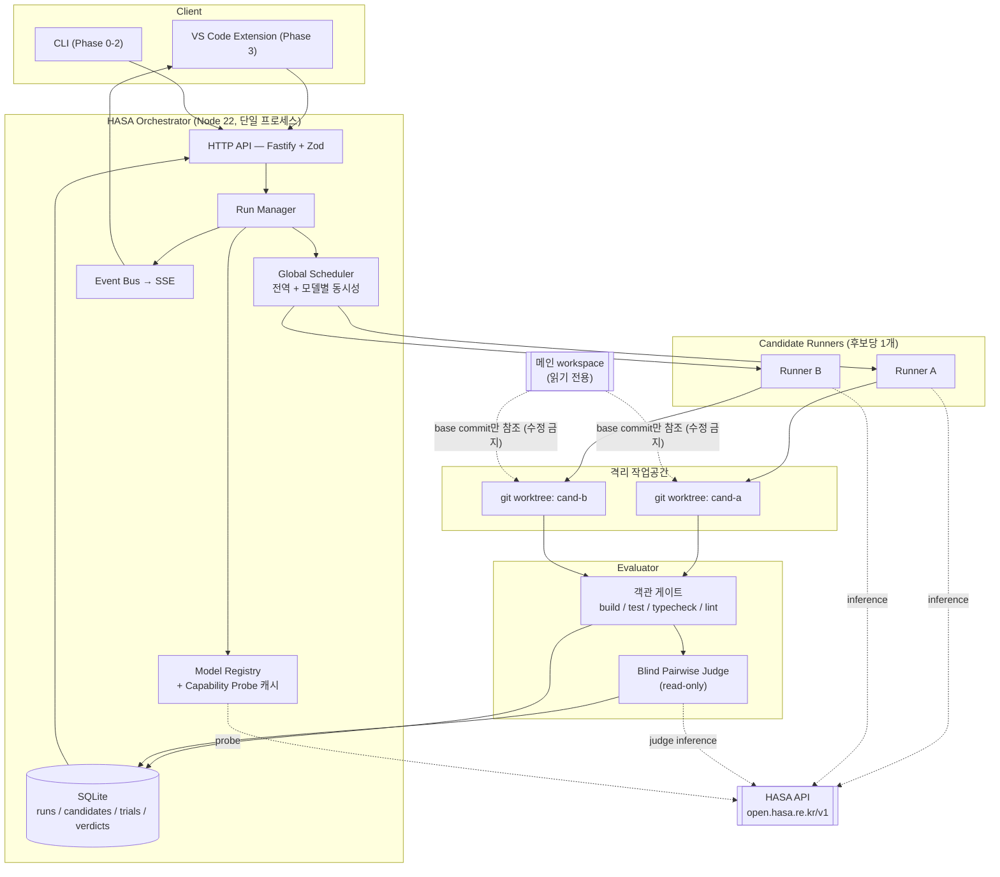

# HASA Agent Arena — Architecture

> 상태: **설계 초안 (Phase -1)**. 코드 미구현. 본 문서의 인터페이스는 확정 API가 아니라 설계 계약(contract)의 초안이며, `implementation-plan.md`의 "불확실 API" 표에 검증 필요 항목이 정리되어 있다.

---

## 0. 실측 기반 사실 (2026-07-29 확인)

설계의 전제가 되는 저장소·환경 실측 결과다. 추측이 아니라 실제 명령 실행 결과다.

| 항목 | 실측 결과 | 설계에 미치는 영향 |
|---|---|---|
| 작업 디렉터리 | `c:\Users\KimGiHu\Downloads\HAFA_Extension` — **파일 0개** | 그린필드. 기존 코드와의 호환 제약 없음 |
| `package.json` / lockfile | **없음** | 패키지 매니저·모듈 시스템을 자유롭게 선택 가능 → pnpm workspace 채택 |
| 기존 테스트 구조 | **없음** | 테스트 러너 자유 선택 → `node:test` 또는 vitest |
| `git rev-parse --show-toplevel` | **`C:/Users/KimGiHu`** (홈 디렉터리 전체가 git 저장소, remote `GITC_YNU_Education.git`) | **치명적.** 이 폴더는 독립 저장소가 아니라 홈 저장소의 untracked 하위 폴더. Git worktree 설계가 성립하지 않음 → 별도 `git init` 필수 (Phase -1) |
| `git worktree list` | `C:/Users/KimGiHu 119311c` — 단일 worktree | 위와 동일 |
| `node` / `npm` / `pnpm` / `corepack` | **PATH에 없음** | Phase 0 실행 불가. Node 22+ 설치가 선행 조건 |
| `git` | `2.36.1.windows.1` | worktree 기능은 사용 가능하나 구버전. `git worktree` 관련 최신 옵션(예: `--orphan`)은 미지원일 수 있음 → 검증 필요 |
| VS Code CLI | `...\Microsoft VS Code\bin\code.cmd` 존재 | Phase 3 확장 개발 환경은 갖춰짐 |

> **결론:** 코드를 쓰기 전에 (a) Node 22+ 설치, (b) `HAFA_Extension`을 독립 git 저장소로 분리하는 두 가지 부트스트랩이 반드시 선행되어야 한다. 자세한 절차는 `implementation-plan.md` Phase -1 참조.

---

## 1. 제품 정의

### 1.1 한 줄 정의

> **HASA Agent Arena = 모델 실행기 + 격리된 작업공간 + 검증 가능한 평가기 + VS Code UI**

핵심 가치는 "여러 모델을 붙이는 것"이 아니라 **"공정한 후보 생성과 재현 가능한 평가"** 다. 모델 연결은 수단이고, 평가 코어가 제품이다.

### 1.2 명시적 비목표 (Non-goals)

이 목록은 스코프 크리프를 막기 위한 것이며, 설계 리뷰 시 반드시 참조한다.

| 비목표 | 이유 |
|---|---|
| Best-of-N **프록시** (`/v1/chat/completions` 레벨에서 후보를 골라 하나만 반환) | 코딩 에이전트에서는 성립하지 않는다. 모델 A와 B가 서로 다른 tool call을 생성하면 다음 턴의 대화 컨텍스트가 후보별로 갈라지고, 스트리밍 중에는 어느 후보가 우수한지 판정할 근거(파일 수정 결과·테스트 결과)가 아직 존재하지 않는다. |
| 자동 코드 적용 (auto-apply) | 사람 검토 없는 적용은 제품 신뢰를 파괴한다. `apply`는 항상 명시적 사용자 액션이다. |
| 범용 멀티 에이전트 협업 프레임워크 | Cline Agent Teams / Zoo Orchestrator는 작업을 **분할·위임**하는 구조다. 우리가 만드는 것은 동일 작업의 **독립 중복 실행 + 토너먼트**로, 목적이 다르다. |
| 모델 학습·파인튜닝 | 범위 밖. 평가 결과 데이터셋 축적까지만 한다. |
| 비 Git 프로젝트 지원 (Phase 2 기준) | worktree 격리가 불가능하므로 코드 비교 모드에서 제외한다. |

### 1.3 두 개의 모드 — API를 분리한다

단일 API로 두 가지를 다 처리하려는 시도가 가장 흔한 설계 실패다. **표면을 분리한다.**

| | **Response Compare 모드** | **Code Candidate 모드** |
|---|---|---|
| 대상 | 질의응답, 계획서, 문서 요약 | 실제 코드 변경 |
| 파일 수정 | 없음 | worktree 내에서만 |
| tool calling 필요 | 불필요 | **필수** (미지원 모델 자동 제외) |
| 비교 대상 | 텍스트 응답 | **최종 diff + 테스트 결과 + 실행 궤적** |
| 평가 | blind pairwise judge | 객관 게이트 9단계 → 마지막에 judge |
| 구현 시기 | Phase 1 | Phase 2 |

두 모드 모두 **동일한 `/runs` 리소스 모델**을 쓴다. `mode` 필드로 구분한다. OpenAI 호환 `/v1/chat/completions` 표면은 **오케스트레이터가 제공하지 않는다** — 단일 모델 호출은 클라이언트가 HASA에 직접 하면 되고, 우리가 프록시를 끼면 위 1.2의 실패 모드로 되돌아간다.

---

## 2. 시스템 구성



### 2.1 프로세스 경계와 신뢰 경계

- **Orchestrator 프로세스만이 HASA API Key를 보유한다.** Runner는 같은 프로세스 내 모듈이거나 자식 프로세스지만, 어느 경우에도 키는 webview·확장 UI·로그에 노출되지 않는다 (`security-policy.md` §1).
- **Webview는 신뢰 경계 바깥이다.** 실행 상태와 결과만 SSE로 수신하고, 키·원문 프롬프트는 받지 않는다.
- **메인 workspace는 읽기 전용이다.** base commit SHA를 읽는 용도로만 접근하고, `apply` 단계 이전에는 어떤 쓰기도 하지 않는다.

---

## 3. 도메인 모델

### 3.1 계층

```
Run  (하나의 비교 실행)
 └─ Candidate  (하나의 후보 = 모델 + 설정 + worktree)
     ├─ Trial       (실제 에이전트 실행 1회, 재시도 시 복수)
     ├─ GateResult  (객관 게이트 단계별 결과)
     └─ Artifact    (diff, 로그, 실행 궤적)
Verdict  (judge 판정, Run당 복수 — 순서 뒤집기 때문)
```

### 3.2 Candidate는 "모델 이름"이 아니다

공정성의 핵심. 후보는 다음 필드 **전체**의 묶음이며, **모델 ID를 제외한 모든 필드가 후보 간 동일**해야 한다.

```jsonc
{
  "candidateId": "cand-a",              // judge에게 절대 노출 금지
  "modelId": "…",                        // GET /v1/models 결과에서만 선택. 하드코딩 금지
  "systemPromptVersion": "coding-agent-v1",
  "temperature": 0.2,
  "topP": 1.0,
  "maxOutputTokens": 8192,
  "toolProfile": "safe-coding",          // 후보 간 동일한 도구 목록
  "maxIterations": 25,
  "baseCommit": "9f2c1ab…",              // Run 내 모든 후보가 동일
  "worktreePath": ".arena/worktrees/cand-a",
  "seedPolicy": "unset",                 // HASA가 seed를 지원하는지 미검증
  "runtimeAdapter": "clinecore | patch-mode"
}
```

> **불변식 (fairness invariant):** 한 Run 안에서 `modelId`와 `candidateId`, `worktreePath`를 제외한 모든 필드가 동일하지 않으면 Run을 시작하지 않고 `400`으로 거부한다. 이 검증은 Zod 스키마가 아니라 별도 `assertFairness(candidates)` 함수로 구현하고 단위 테스트를 붙인다.

### 3.3 SQLite 스키마 초안

```sql
CREATE TABLE runs (
  id            TEXT PRIMARY KEY,          -- ULID
  mode          TEXT NOT NULL,             -- 'response' | 'code'
  status        TEXT NOT NULL,             -- queued|running|evaluating|awaiting_review|applied|no_winner|failed|cancelled
  task_spec     TEXT NOT NULL,             -- JSON
  base_commit   TEXT,                      -- code 모드만
  repo_root     TEXT,
  created_at    INTEGER NOT NULL,
  finished_at   INTEGER
);

CREATE TABLE candidates (
  id            TEXT PRIMARY KEY,
  run_id        TEXT NOT NULL REFERENCES runs(id),
  label         TEXT NOT NULL,             -- 'cand-a' … 사용자 노출용
  spec          TEXT NOT NULL,             -- 위 3.2 JSON
  status        TEXT NOT NULL,
  excluded_reason TEXT,                    -- 'no_tool_calling' | '403' 등
  diff_path     TEXT,
  score         REAL,
  UNIQUE(run_id, label)
);

CREATE TABLE trials (
  id            TEXT PRIMARY KEY,
  candidate_id  TEXT NOT NULL REFERENCES candidates(id),
  attempt       INTEGER NOT NULL,
  started_at    INTEGER, finished_at INTEGER,
  tokens_in     INTEGER, tokens_out INTEGER,
  tool_calls    INTEGER,
  error_code    TEXT,                      -- '429' | '403' | 'timeout' | …
  trace_path    TEXT                       -- 실행 궤적 JSONL
);

CREATE TABLE gate_results (
  id            TEXT PRIMARY KEY,
  candidate_id  TEXT NOT NULL REFERENCES candidates(id),
  gate          TEXT NOT NULL,             -- 'patch_applies'|'build'|'test'|…
  passed        INTEGER NOT NULL,
  detail        TEXT,                      -- 요약 (전체 로그는 파일)
  duration_ms   INTEGER
);

CREATE TABLE verdicts (
  id            TEXT PRIMARY KEY,
  run_id        TEXT NOT NULL REFERENCES runs(id),
  judge_model   TEXT NOT NULL,
  pair          TEXT NOT NULL,             -- 'cand-a|cand-b'
  presentation_order TEXT NOT NULL,        -- 'AB' | 'BA'
  winner        TEXT,                      -- NULL = tie/no_winner
  confidence    REAL,
  reasons       TEXT,
  raw_response_path TEXT
);

CREATE TABLE capability_matrix (
  model_id      TEXT NOT NULL,
  capability    TEXT NOT NULL,             -- 'chat'|'stream'|'tools'|…
  status        TEXT NOT NULL,             -- 'pass'|'fail'|'unknown'|'denied'
  evidence      TEXT,
  probed_at     INTEGER NOT NULL,
  PRIMARY KEY (model_id, capability)
);
```

전체 로그·diff·실행 궤적은 DB가 아니라 `.arena/runs/<runId>/` 하위 파일에 저장하고 DB에는 경로만 둔다. (JSONL 병행 저장 — Phase 1 요구사항)

---

## 4. HTTP API 표면

```
POST   /runs                     Run 생성 (mode, candidates, taskSpec)
GET    /runs                     목록
GET    /runs/:id                 상태 + 요약
GET    /runs/:id/events          SSE 이벤트 스트림
GET    /runs/:id/candidates      후보별 상태·점수·게이트 결과
GET    /runs/:id/candidates/:cid/diff    통합 diff (code 모드)
GET    /runs/:id/verdicts        judge 판정 원문
POST   /runs/:id/cancel          취소
POST   /runs/:id/apply           { candidateId } — 명시적 승인 후에만
POST   /runs/:id/reject          전체 기각 → no_winner 확정, worktree 정리 예약

GET    /models                   Registry 뷰 (capability matrix 포함)
POST   /models/probe             재프로빙 트리거
GET    /healthz
```

모든 요청 바디는 Zod 스키마로 검증하고, 스키마는 `packages/protocol`에 두어 서버·CLI·확장이 공유한다.

### 4.1 SSE 이벤트 스키마

```ts
type ArenaEvent =
  | { type: "run.status";       runId: string; status: RunStatus; at: number }
  | { type: "candidate.status"; candidateId: string; status: CandidateStatus;
      excludedReason?: string }
  | { type: "candidate.progress"; candidateId: string;
      phase: "thinking" | "tool" | "editing"; toolName?: string; step: number }
  | { type: "gate.result";      candidateId: string; gate: GateName;
      passed: boolean; durationMs: number }
  | { type: "judge.progress";   pair: string; order: "AB" | "BA" }
  | { type: "run.result";       outcome: "winner" | "no_winner";
      winnerCandidateId?: string; awaitingReview: true }
  | { type: "error";            scope: "run" | "candidate"; code: string;
      retryable: boolean; candidateId?: string };
```

> **원문 프롬프트·모델 응답 전문은 이벤트에 싣지 않는다.** UI가 필요로 하는 것은 진행 상태와 요약이며, 전문은 별도 인증된 엔드포인트로만 조회한다 (`security-policy.md` §4).

---

## 5. 동시성 — 전역 스케줄러

앞선 설계 리뷰에서 지적된 결함(요청 핸들러 내부에서 `Semaphore`를 생성하면 요청마다 새 인스턴스가 만들어져 전역 GPU 동시성 제한이 걸리지 않음)을 구조적으로 차단한다.

```ts
// packages/core/src/scheduler.ts — 모듈 스코프 싱글턴. 요청 핸들러에서 생성 금지.
interface Scheduler {
  submit<T>(job: { modelId: string; priority: number;
                   run: (signal: AbortSignal) => Promise<T> }): Promise<T>;
}
```

규칙:

1. 스케줄러 인스턴스는 **앱 부팅 시 1회** 생성되어 DI로 주입된다. `route()` 내부 생성은 lint 규칙으로 금지한다.
2. 제한은 **2단계**다 — 전역 동시 인플라이트 상한, 그리고 **모델별 큐**의 상한. HASA는 GPU 백엔드 공유이므로 모델별 제한이 실효적이다.
3. `429` 수신 시 **`Retry-After` 헤더를 우선 준수**하고, 헤더가 없을 때만 exponential backoff + **equal jitter**. 해당 모델 큐 전체를 일시 정지(circuit half-open)시켜 재시도 폭풍을 막는다.

   대기는 지수 구간의 **위쪽 절반**에서 뽑는다(`exp/2 + rnd()·exp/2`). full jitter(`rnd()·exp`)는 무리를 완벽히 분산시키지만 0에 가까운 대기를 허용하고, 2026-08-03 실제로 그렇게 됐다 — 게이트웨이가 아직 로드하지 못한 모델에 재시도 3회가 228ms·75ms·3ms 간격으로 나가 560ms 만에 예산을 소진했다. 3밀리초 안에 바뀔 수 있는 것은 없으므로 셋 다 실패가 예정돼 있었다. 절반 구간도 상수가 아니므로 분산은 유지되고, 포기하는 것은 재시도가 애초에 도움이 될 수 없던 범위뿐이다.
4. `503`(GPU backend unavailable)은 재시도 대상이지만 `403`(model access denied)·`404`(unregistered model)는 **재시도하지 않고** 후보를 즉시 제외 처리한다.
5. 모든 잡은 `AbortSignal`을 받는다. Run 취소 시 전파된다.

---

## 6. Agent Runtime 추상화

**핵심 설계 결정: 런타임을 인터페이스 뒤에 둔다.** Cline SDK의 OpenAI 호환 custom base URL 지원이 불확실하므로(§7), 런타임을 교체 가능하게 만들지 않으면 SDK 하나에 프로젝트 전체가 인질이 된다.

```ts
interface AgentRunner {
  readonly id: "clinecore" | "patch-mode";
  /** 이 런타임이 해당 후보 스펙을 실행할 수 있는지 */
  supports(spec: CandidateSpec, caps: CapabilityRecord): boolean;
  run(input: {
    spec: CandidateSpec;
    taskSpec: TaskSpec;
    workdir: string;          // worktree 경로
    signal: AbortSignal;
    onEvent: (e: RunnerEvent) => void;
  }): Promise<RunnerResult>;  // { changedFiles, commands, tokens, trace }
}
```

### 6.1 어댑터 A — ClineCore (우선 검토)

문서상 확인된 표면 (docs.cline.bot, 설치본 미확인):

```ts
import { ClineCore } from "@cline/sdk";

const cline = await ClineCore.create({
  clientName: "hasa-arena",
  backendMode: "local",
  capabilities: {
    requestToolApproval: async (req) => ({ approved: policy.allows(req) }),
  },
});

const session = await cline.start({
  prompt: taskSpec.prompt,
  config: {
    providerId: "hasa",          // ← 플러그인이 등록한 provider id
    modelId,
    apiKey: process.env.HASA_API_KEY,
    systemPrompt,
    cwd: worktreePath,
    workspaceRoot: worktreePath,
    enableTools: true,
    extensions: [hasaProviderPlugin],   // 또는 pluginPaths
    toolPolicies: {
      read_files:   { autoApprove: true },
      run_commands: { autoApprove: false },   // allowlist 훅에서 판단
    },
  },
});
```

메서드: `start`, `send({sessionId, prompt})`, `list`, `readMessages(sessionId)`, `abort(sessionId)`, `subscribe(cb)`.

### 6.2 HASA provider 연결 — **세션 config에서 직접 지원됨 (설치본 검증)**

`@cline/sdk@0.0.66`을 실제로 설치해 타입 정의를 확인한 결과, 문서와 커뮤니티 논의보다 실제 API가 앞서 있었다.

`@cline/core/dist/types/config.d.ts`의 `CoreModelConfig`:

```ts
interface CoreModelConfig {
  providerId: string;
  modelId: string;
  apiKey?: string;
  baseUrl?: string;                       // ← 세션 config 레벨에서 직접 지원
  headers?: Record<string, string>;
  knownModels?: Record<string, ModelInfo>;
  temperature?: number;
  maxTokensPerTurn?: number;
}
```

`services/llms/runtime-types.d.ts`의 `ProviderSelectionConfig`도 `baseUrl` / `apiKey` / `apiKeyEnv` / `headers` / `timeoutMs`를 받는다.

> **정정:** [discussion #10322](https://github.com/cline/cline/discussions/10322)은 custom baseURL을 미지원 feature request로 다루지만, 0.0.66에는 이미 구현되어 있다. **설치본의 타입 정의가 문서·논의보다 우선한다** — 이것이 계획서에서 "설치된 버전의 실제 API를 확인한다"를 별도 항목으로 둔 이유다.

예제가 사용하는 실제 API:

```ts
import { type AgentPlugin, Llms } from "@cline/core";

const provider: Llms.ProviderInfo = {
  id: "hasa",
  name: "HASA Open API",
  protocol: "openai-chat",          // ← OpenAI Chat Completions 프로토콜
  client: "openai-compatible",      // ← 게이트웨이가 baseUrl로 핸들러 구성
  baseUrl: "https://open.hasa.re.kr/v1",
  defaultModelId: /* 런타임 결정 */,
  env: ["HASA_API_KEY"],            // 세션 config 또는 이 env로 키 해석
  capabilities: [/* probe 결과에서 채움 */],
  source: "file",
};

Llms.registerProvider({ provider, models });   // models: Record<string, Llms.ModelInfo>
```

### 6.2.1 그럼에도 자체 agent 루프를 구현한 이유

Phase 2는 ClineCore를 임베드하지 않고 `AgentRunner` 뒤에 자체 tool-calling 루프를 두었다. 근거는 하나다.

`security-policy.md`가 요구하는 것들 — realpath 기준 worktree 경계(§2.3), symlink 탈출 차단, allowlist 명령 실행(§2.1), 자식 프로세스로의 키 비상속(§1.3) — 은 **테스트로 증명해야 하는 속성**이다. ClineCore에 위임하면 도구 구현은 그쪽 것이고, 우리가 가진 것은 `requestToolApproval` 거부권뿐이다. 승인 콜백은 "이 명령을 실행할까?"에 답할 수 있지만 "이 파일 읽기가 symlink로 worktree를 벗어나는가?"를 우리 규칙대로 판정하지는 못한다.

따라서:

- **런타임 인터페이스는 유지한다.** §6.2에서 확인한 `CoreModelConfig` 형태 그대로 ClineCore 어댑터를 추가할 수 있다
- 자체 루프는 도구 5개(`list_files`, `read_file`, `write_file`, `run_command`, `finish`)만 노출하고 전부 Sandbox·allowlist를 통과시킨다
- 거부는 예외가 아니라 **tool 결과로 모델에게 되돌려준다** — 경계를 배우고 합법적인 다른 시도를 하도록. 계속 시도하면 자기 예산만 소모한다

**모델 카탈로그를 정적으로 쓰지 않는다 (ClineCore 어댑터 도입 시).**

예제는 `MODELS`를 소스에 하드코딩하지만, 우리 제약은 "모델 ID 하드코딩 금지"다. 따라서 플러그인을 **팩토리로 생성**한다:

```
GET /v1/models  →  Capability Probe  →  Llms.ModelInfo[] 동적 구성  →  플러그인 생성  →  ClineCore 세션에 extensions로 주입
```

`Llms.ModelInfo.capabilities`(`"tools" | "streaming" | "reasoning" | "images" | "prompt-cache"`)는 **probe 결과로 채운다.** 문서에 적힌 값이 아니라 실제 요청으로 확인한 값만 넣는다. `contextWindow`·`maxTokens`도 probe로 측정한 보수적 값을 쓴다.

### 6.3 어댑터 B — patch-mode (fallback, 필수)

HASA 모델 상당수가 native tool calling을 지원하지 않을 가능성이 실재한다 (HASA 문서에 tool calling 언급 자체가 없음). tool calling 없는 모델을 코드 모드에서 **전부 제외**해 버리면 후보가 0~1개만 남아 Arena가 성립하지 않을 수 있다.

따라서 두 번째 어댑터를 둔다:

- 에이전트 루프 없이, **파일 컨텍스트를 프롬프트에 넣고 unified diff를 생성**시킨다.
- 생성된 diff를 `git apply --check` → `git apply`로 worktree에 적용.
- 적용 실패 시 1회 재시도(오류 메시지 피드백), 그래도 실패하면 후보 탈락.

> **공정성 주의:** patch-mode 후보와 ClineCore 후보를 **같은 Run에서 비교하지 않는다.** 런타임이 다르면 능력 차이가 모델 차이로 오인된다. `assertFairness`가 `runtimeAdapter` 불일치를 거부한다. patch-mode는 "tool calling 미지원 모델끼리의 별도 리그"다.

### 6.4 Judge runner

judge는 `AgentRunner`가 아니다. **도구도 파일 접근도 없는 순수 chat 호출**이며, 별도의 얇은 클라이언트를 쓴다. 자세한 계약은 `evaluation-protocol.md` §5.

---

## 7. 작업공간 격리 (Git worktree)

```
<repo-root>/
  .arena/                       ← .gitignore 등록
    runs/<runId>/
      candidates/<label>/
        diff.patch
        trace.jsonl
        logs/{build,test,typecheck,lint}.log
    worktrees/<runId>-<label>/  ← git worktree add 대상
```

절차:

1. Run 시작 시 `git rev-parse HEAD`로 **base commit SHA를 1회 고정**하고 `runs.base_commit`에 기록한다. 이후 모든 후보는 이 SHA에서만 출발한다.
2. 시작 전 `git status --porcelain`으로 **메인 workspace가 clean인지 확인**한다. dirty면 (a) 거부하거나 (b) 사용자 동의 하에 stash 기반 임시 커밋을 만들고 그 SHA를 base로 쓴다. 기본값은 (a) 거부.
3. 후보마다 `git worktree add --detach <path> <baseCommit>`.
4. 실행 종료 후 diff는 `git -C <worktree> diff <baseCommit>` 로 추출한다 (커밋 여부와 무관하게 변경 포착).
5. **worktree는 즉시 삭제하지 않는다.** `applied` 또는 `reject` 이후, 혹은 TTL 만료 후에만 `git worktree remove`. 사용자가 검토 중에 근거가 사라지면 안 된다.
6. 크래시 대비: 부팅 시 `git worktree prune` + `.arena/runs`의 고아 Run을 `failed`로 마감하는 복구 루틴.

### 7.1 Windows·환경 제약 (실측 반영)

| 이슈 | 대응 |
|---|---|
| `node_modules`는 worktree에 복사되지 않음 (git 미추적) | 후보 실행 전 의존성 설치가 필요. pnpm store 공유 또는 심볼릭 링크. **비용이 크므로 Phase 2에서 벤치마크 필수** |
| `.env` 등 미추적 설정 파일 | Zoo의 `.worktreeinclude` 유사 개념이 필요하지만, **`.env` 복사는 보안 정책상 금지**(`security-policy.md` §2). 필요한 값은 orchestrator가 안전하게 주입 |
| Windows 경로 길이 260자 제한 | `.arena/worktrees` 경로를 짧게 유지. 필요 시 `core.longpaths` 확인 |
| git 2.36 (구버전) | worktree 기본 기능은 충분하나 최신 옵션 미지원 가능. Phase 2에서 실제 검증 |
| 저장소 루트가 아닌 하위 폴더 | Zoo Worktrees도 "repository root, not subfolders"를 요구. 현재 상태(홈 디렉터리가 루트)로는 불가 → Phase -1의 `git init` 필수 |

---

## 8. 패키지 레이아웃

**단일 패키지 + 디렉터리 경계**를 채택했다 (Phase 0 구현 시 확정).

당초 pnpm workspace 모노레포를 계획했으나, 런타임을 **Node 24의 네이티브 타입 스트리핑**으로 잡으면서 방침을 바꿨다. Node는 `node_modules` 아래의 `.ts` 파일을 타입 스트리핑하지 않으므로, workspace 링크(= `node_modules` 심볼릭 링크)로 패키지를 참조하면 빌드 단계 없이는 동작하지 않는다. 빌드 산출물(`dist/`)을 두는 대신 빌드 단계 자체를 없애는 쪽을 택했다 — 소스가 곧 실행 대상이므로 `pnpm probe`가 컴파일 없이 즉시 돈다.

```
HAFA_Extension/
  docs/
  src/
    protocol/        Zod 스키마 + 타입 (서버·CLI·확장 공유)
    hasa-client/     HASA HTTP 클라이언트: 인증, SSE 파싱, 429/Retry-After, 마스킹
    probe/           Phase 0. capability probe + matrix 생성 (CLI: pnpm probe)
    core/            스케줄러, Store, EventHub, fairness, judge, RunManager
    server/          Fastify HTTP + SSE
    testing/         mock HASA 게이트웨이 (키·네트워크 없이 전체 파이프라인 테스트)
    runtime-cline/   (Phase 2) ClineCore 어댑터 + HASA provider 플러그인 팩토리
    runtime-patch/   (Phase 2) patch-mode 어댑터
  extension/         (Phase 3) VS Code 확장
  .arena/            런타임 산출물 (gitignore)
```

의존 방향은 단방향이다: `protocol ← hasa-client ← probe/core ← runtime-* ← server`. 규모가 커지면 workspace로 승격하되, 그때는 빌드 파이프라인을 함께 도입한다.

### 8.1 런타임·툴체인 결정

| 항목 | 선택 | 이유 |
|---|---|---|
| Node | **24 LTS** (`engines: >=24.0.0`) | 타입 스트리핑 무플래그, `node:sqlite` 사용 가능. Cline SDK의 Node 22+ 요구도 충족 |
| 빌드 | **없음** | `.ts`를 Node가 직접 실행. `tsc`는 `--noEmit` 타입 검사 전용 |
| TS 설정 | `erasableSyntaxOnly`, `allowImportingTsExtensions`, `verbatimModuleSyntax` | 타입 스트리핑 제약(enum·파라미터 프로퍼티 금지, `.ts` 확장자 명시)을 컴파일러가 강제 |
| 테스트 | `node --test` | 러너 의존성 0 |
| DB | `node:sqlite` | 네이티브 빌드 툴체인 불필요. 미지원 런타임에서는 memory+JSONL로 degrade |
| 런타임 의존성 | `fastify`, `zod` **2개** | 공급망 표면 최소화 (`security-policy.md` §6) |

---

## 9. Zoo Code fork vs 독립 실행 코어 — 결론

**결론: fork하지 않는다. 독립 실행 코어를 만들고, Zoo Code는 Phase 3 UI 설계의 참고 자료로만 쓴다.**

| 기준 | Zoo Code fork | 독립 코어 (채택) |
|---|---|---|
| worktree 오케스트레이션 | [문서상](https://docs.zoocode.dev/features/worktrees) worktree마다 **별도 VS Code 창**을 여는 사람 주도 UX. **merge-back 절차가 문서화되어 있지 않음**. 프로그램적 병렬 실행 API가 아님 | `git worktree` 직접 제어. 완전한 통제 |
| tool calling | [native tool calling **전용**, XML fallback 없음](https://docs.zoocode.dev/providers/openai-compatible). HASA 모델이 미지원이면 그대로 사용 불가 | patch-mode fallback 자체 구현 가능 (§6.3) |
| Orchestrator | Boomerang은 작업 **분할·위임** 구조. 동일 작업 중복 실행 + 토너먼트는 **어차피 별도 구현** 필요 | 처음부터 목적에 맞게 설계 |
| 저장소 제약 | repo root만 지원, multi-root 미지원 | 동일 제약을 우리가 명시적으로 관리 |
| 유지보수 | 대규모 확장 fork의 upstream 추종 비용이 지속 발생 | 코드베이스가 작고 목적이 명확 |
| 초기 속도 | UI는 빠르지만 평가 코어는 어차피 신규 | 평가 코어에 집중 |

Zoo에서 **차용할 개념**: API Configuration Profiles(모드별 프로필 분리), `.worktreeinclude`(미추적 파일 처리 — 단, `.env`는 제외), checkpoint UX.

Cline은 **런타임으로만** 쓴다. Agent Teams는 코디네이터가 위임하는 구조라 우리 토너먼트 모델과 다르므로 사용하지 않는다.

---

## 10. 위험 요소 요약

전체 위험 레지스터는 `implementation-plan.md` §5에 있다. 아키텍처에 직결되는 것만:

| # | 위험 | 영향 | 완화 |
|---|---|---|---|
| A1 | HASA가 native tool calling을 미지원 | 코드 모드 후보 0~1개 → 제품 성립 불가 | Phase 0 probe로 **가장 먼저 확인**. patch-mode 어댑터 필수 구현 (§6.3) |
| A2 | ClineCore가 plugin provider 등록을 실제로는 다르게 요구 | 런타임 교체 필요 | `AgentRunner` 인터페이스로 격리 (§6). Phase 0 말에 spike로 검증 |
| A3 | 홈 디렉터리가 git 루트 | worktree 설계 불성립, **홈 전체 커밋 사고 위험** | Phase -1에서 독립 `git init` (최우선) |
| A4 | Node 미설치 | Phase 0 착수 불가 | Phase -1 |
| A5 | worktree별 의존성 설치 비용 | 후보 실행 시간이 비현실적으로 증가 | Phase 2 초반 벤치마크. pnpm store 공유 전략 |
| A6 | judge의 position bias | 평가 신뢰도 붕괴 | 순서 뒤집기 2회 + 불일치 시 `no_winner` (`evaluation-protocol.md`) |

---

## 11. 관련 문서

- `compatibility-matrix.md` — probe 항목·판정 기준·모델 자격 규칙
- `security-policy.md` — 키 취급, 명령 allowlist, 격리 규칙
- `evaluation-protocol.md` — 게이트 순서, 점수, blind judge 절차
- `implementation-plan.md` — Phase -1 ~ 3, 위험 레지스터, 불확실 API 목록
