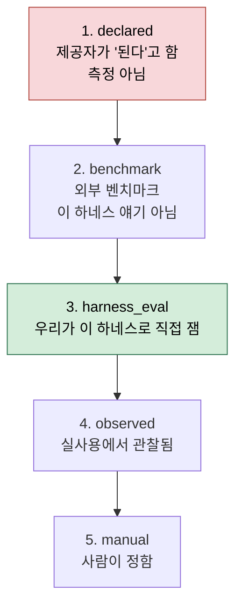
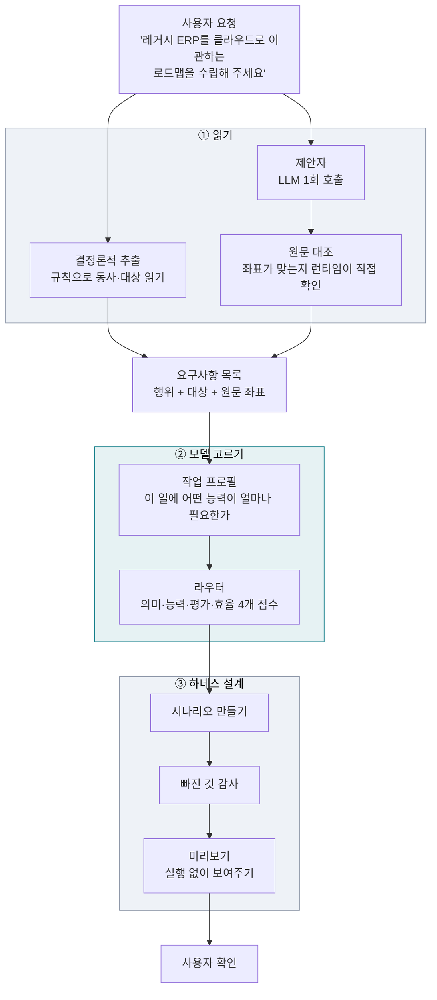
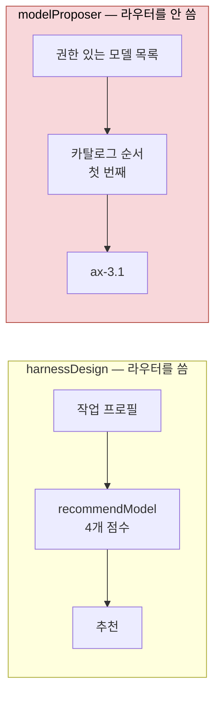
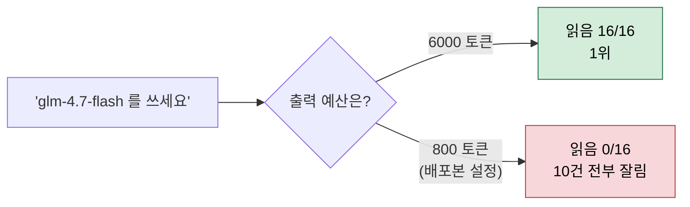
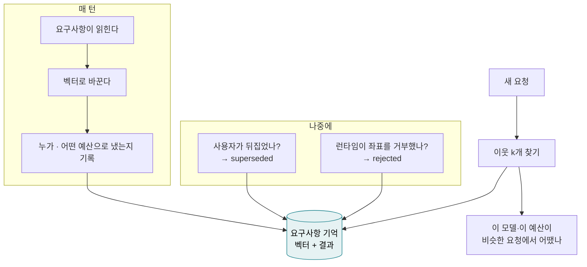
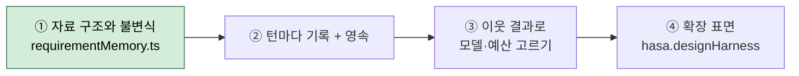

# 모델 실측과 요구사항 기억 — 용어와 설계

이 문서는 최근 작업(모델 35종 실측 → 역할 배정 → 요구사항 기억)에서 쓰인 말들을
평범한 말로 다시 풀고, 전체 설계가 어디로 가는지를 그림과 함께 적는다.

앞선 커밋 메시지와 보고가 **작성자만 알아듣는 축약어**로 되어 있었다. 그 지적이
맞고, 이 문서가 그 빚을 갚는다. 코드를 읽지 않은 사람이 이 문서만으로 무엇을
만들고 있는지 알 수 있어야 한다.

관련 문서: [`harness-auto-design.md`](harness-auto-design.md) (파이프라인 전체),
[`model-recommendation.md`](model-recommendation.md) (라우터 설계).

---

## 1. 용어 사전

### 1.1 가장 헷갈리는 말부터 — "하네스"

이 저장소에서 **하네스(harness)** 는 두 가지 뜻으로 쓰인다. 섞어 쓴 것이 혼란의
큰 몫이었다.

| | 뜻 | 예 |
|---|---|---|
| **(가) 산출물로서의 하네스** | 사용자 요청을 받아 짜 놓은 **실행 계획** — 요구사항, 시나리오, 무엇을 검증할지 | `harnessDesign.ts` 가 만드는 것. 저장소 이름의 "Harness" |
| **(나) 검사 장치로서의 하네스** | 테스트가 제대로 검사하고 있는지를 **검사하는 도구** | `scripts/mutate.mjs`, `scripts/answers.mjs` |

아래에서 "변이 하네스", "답변 하네스"라고 쓰면 (나)이고, 그냥 "하네스"는 (가)다.

### 1.2 파이프라인 용어

| 용어 | 뜻 |
|---|---|
| **요구사항 (RequirementSpec)** | 사용자 문장에서 읽어낸 "무엇을 해야 하는가" 한 건. 행위(고친다/분석한다), 대상, 원문에서의 위치를 갖는다 |
| **제안자 (proposer)** | 사용자 문장을 읽고 요구사항 후보를 뽑아내는 **역할**. LLM을 한 번 부른다 |
| **결정론적 추출** | LLM 없이 규칙으로 읽는 쪽 (`functionalExtract.ts`). 동사와 조사를 보고 읽는다 |
| **좌표 / 구간 (span)** | 요구사항이 원문 **몇 번째 글자부터 몇 번째 글자까지**에서 왔는지 |
| **원문 대조** | 모델이 "이 요구사항은 여기서 왔다"고 말한 좌표를, 런타임이 실제로 잘라 보고 맞는지 확인하는 것 |
| **골드 (gold)** | 사람이 미리 적어 둔 정답 |
| **말뭉치 (corpus)** | 문장 모음 + 그 골드. 예: `proposerCases.ts` = 컨설팅 요청 10문단 + 정답 16건 |

### 1.3 검사 장치 용어

| 용어 | 뜻 | 왜 필요한가 |
|---|---|---|
| **변이 테스트 (mutation testing)** | 소스의 방어 코드를 **일부러 망가뜨리고** 테스트가 빨개지는지 본다 | 테스트가 통과한다는 것과, 테스트가 무언가를 지키고 있다는 것은 다르다 |
| **"문다 (bite)"** | 변이를 넣었을 때 테스트가 실제로 실패하는 것 | "물지 않는다" = 그 코드는 아무도 안 보고 있었다 = **구멍** |
| **답변 하네스 (`answers.mjs`)** | 반대 방향. **정답을 일부러 틀리게** 바꾸고 테스트가 빨개지는지 본다 | 정답이 적혀만 있고 아무도 안 읽는 경우를 잡는다 |
| **as-built 못 박기** | 런타임이 정답과 다르게 동작하는 걸 알면서 그 **현재 동작**을 테스트에 고정해 두는 것 | 나중에 우연히 고쳐지면 그 못이 실패해서 알려준다 |

> **두 방향이 필요한 이유.** 변이 테스트는 "코드에서 방어를 빼면 알아채는가"를 묻고,
> 답변 하네스는 "정답을 바꾸면 알아채는가"를 묻는다. 지금까지 발견된 구멍은 전부
> 두 번째 방향에서 나왔다.

### 1.4 모델 측정 용어 — 여섯 축

제안자 과업(문단을 읽고 요구사항 + 좌표를 JSON으로 내기)을 여섯 갈래로 나눠 잰다.
**나눈 이유는 고치는 방법이 다르기 때문**이다.

| 축 | 묻는 것 | 낮으면 무엇을 고치나 |
|---|---|---|
| **형식 (shape)** | JSON 배열로 답했는가 | 지시문 |
| **읽음 (named)** | 요구사항을 찾아 제 문장으로 썼는가 | **모델** |
| **지목 (pointed)** | 글자 좌표가 실제로 그 말 위에 떨어졌는가 | 지시문 + 모델 |
| **지어냄 (invented)** | 원문에 없는 요구를 만들었는가 | **모델** |
| **옮겨적음 (transcribed)** | 지시를 어기고 원문을 그대로 베꼈는가 | 지시문 |
| **잘림 (truncated)** | 출력 예산이 모자라 답이 끊겼는가 | **예산** (모델 문제가 아님) |

하나의 "정확도"로 합치면 **어디를 고쳐야 하는지가 사라진다.** 그래서 안 합친다.

### 1.5 라우터(모델 추천) 용어

| 용어 | 뜻 |
|---|---|
| **카탈로그 순서** | 게이트웨이가 모델 목록을 돌려주는 순서. 지금 제안자는 이 순서의 **첫 번째**를 고른다 |
| **능력 축 (capability)** | 모델이 무엇을 잘하는지 12가지로 나눈 것 (코딩, 추론, 근거, 지시이행 …) |
| **근거 (sourceGrounding)** | 출처에 있는 것만 말하고 없는 것은 안 만드는 능력 |
| **지시이행 (instructionFollowing)** | 시킨 형식·규칙을 지키는 능력 |
| **증거 등급 (evidence origin)** | 그 능력 점수를 **얼마나 믿을 수 있는가**. 아래 사다리 |
| **스텁 (stub)** | 자리만 잡아둔 가짜 구현. 지금 의미 점수는 **항상 0.5를 반환**한다 |
| **그림자 실행 (shadow)** | 실제 결정에는 안 쓰고 옆에서 같이 돌려 **관찰만** 하는 것 |
| **예산 바닥 (budget floor)** | 이 모델이 답을 내려면 최소한 출력 토큰이 몇 개 필요한가 |

증거 등급 사다리 — 아래로 갈수록 믿을 만하다:



> **지금 이 게이트웨이의 모든 모델은 1등급(declared)이다.** boolean 플래그를
> 0.75 같은 상수로 바꾼 값이고, 그래서 18개 모델이 전부 동점이 된다.

### 1.6 요구사항 기억 용어

| 용어 | 뜻 |
|---|---|
| **벡터 / 임베딩** | 문장을 숫자 묶음으로 바꾼 것. 비슷한 문장은 비슷한 숫자 |
| **벡터 공간 (vector space)** | *어떤* 임베딩 모델이 *어떤* 설정으로 만들었는지. 다른 공간의 벡터끼리 유사도를 재면 숫자는 나오는데 **뜻이 없다** |
| **이웃 (neighbour)** | 지금 요청과 벡터가 가까운 과거 요구사항 |
| **정정 (superseded)** | 사용자가 다음 턴에 앞말을 뒤집는 것. 런타임이 스스로 표시한다 |
| **결과 (outcome)** | 그 요구사항이 어떻게 됐는지 — 정정됨 / 거부됨 / 받아들여짐 / 아직 모름 |

---

## 2. 전체 그림 — 무엇을 만들고 있나



---

## 3. 지금까지 측정한 것

API 키가 닿는 **35개 모델 전부**를 각자가 실제로 하는 일로 물었다 (2026-09-05).

| 종류 | 개수 | 무엇을 물었나 | 결과 |
|---|---|---|---|
| 대화형 | 18 | 제안자 과업 (컨설팅 문단 10개 · 요구 16건) | 아래 표 |
| 임베딩 | 2 | 같은 요구를 다르게 쓴 문장이 다른 단계 문장보다 가까운가 | 10/10 |
| 재순위 | 2 | 낱말을 공유하는 오답 속에서 진짜 근거 문서를 1위로 | **4/10** |
| PII | 1 | 주민번호·계좌는 찾고 `PostgreSQL` 은 안 건드리는가 | 5/5 |
| 양자 | 4 | Bell·GHZ 회로의 진폭이 해석적 정답과 같은가 | 20/20 |
| 음성 | 2 | 합성 → 전사 왕복이 원문으로 돌아오는가 | 5/5 |
| 이미지·영상 | 5 | (정답 없음) 계약만 확인 | 14/14 응답 |
| 미도달 | 1 | `groot-n17-3b` — 목록엔 있는데 모든 경로가 404 | — |

대화형 상위권 (출력 예산 6000 토큰):

| 모델 | 읽음 | 지목 | 지어냄 | 800토큰에서 |
|---|---|---|---|---|
| `glm-4.7-flash` | 16/16 | 4/16 | 24% | **0/16 (10건 전부 잘림)** |
| `llama-3.3-70b` | 14/16 | 1/16 | 13% | 14/16 |
| `nemotron-super-120b` | 13/16 | 9/16 | 7% | **0/16** |
| `ax-3.1` ← 지금 설계기가 고르는 모델 | 9/16 | 0/16 | 10% | 9/16 |

---

## 4. 찾은 문제 셋

### 문제 1 — 모델 선택 경로가 두 갈래고, 제안자 쪽이 약하다



실측이 말하는 것: `ax-3.1` 은 18개 중 **10위**다. 나쁜 선택은 아니지만, 그게
좋아서가 아니라 알파벳 순서상 앞에 있어서 뽑힌 것이다.

### 문제 2 — 라우터를 쓴다고 나아지지 않는다. 증거가 없어서다

같은 말뭉치로 네 가지 선택 방식을 돌린 결과:

| | 고른 모델 | 읽음 | 무슨 일이 있었나 |
|---|---|---|---|
| **A** 카탈로그 순서 (현재) | `ax-3.1` | 9/16 | 순위를 매기지 않음 |
| **B** 라우터 + 선언 증거 | `ax-3.1` | 9/16 | **18개 전부 동점**, 정렬 순서가 결정 |
| **C** 라우터 + 실측 증거 | `llama-3.3-70b` | **14/16** | 근거 0.87 · 지시이행 0.90 |
| **D** C + 예산 제약 | `llama-3.3-70b` | 14/16 | 후보 8개 제외 후에도 같은 답 |

**B가 핵심이다.** 라우터를 끼워도 답이 안 바뀐다. 개선을 만든 건 알고리즘이 아니라
**입력(증거)** 이다.

### 문제 3 — 모델만 고르고 예산을 안 말하면 틀린 추천이다



추론하는 모델은 예산을 **생각하는 데 먼저 쓰고**, 남는 것으로 답을 쓴다. 배포본
설정(800토큰)에서 **18개 중 8개**가 아무것도 내지 못한다.

---

## 5. 요구사항 기억 — 왜 필요하고, 무엇이 조건인가

4번의 실측 증거는 **누군가 스윕을 돌려야** 생긴다. 그럴 필요 없는 모양이 있다 —
요구사항은 어차피 턴마다 지나가고, 그게 어떻게 됐는지도 이미 기록된다.



### 인덱스가 아니라 기억이 되는 조건

> **행마다 결과가 있어야 한다.** 결과 없는 벡터 테이블은 비슷한 과거 요청을
> 찾아줄 뿐, 그게 어떻게 됐는지는 말하지 못한다. 그건 검색 인덱스지 고도화되는
> 시스템이 아니다.

그리고 **결과는 공짜여야 한다.** 누군가 라벨링해야 하면 안 쌓인다. 그래서 런타임이
이미 쓰고 있는 둘에서만 읽는다:

| 결과 | 어디서 오나 | 뜻 |
|---|---|---|
| `superseded` | `supersededBy` 필드 | 사용자가 뒤집음 — **아무도 고르지 않은 정답** |
| `rejected` | `provenance: "invalid"` | 런타임이 좌표를 거부 |
| `accepted` | 위 둘이 아님 | 아직 아무도 안 뒤집음 |
| `unconfirmed` | 기록 시점 | 아직 아무 일도 없음 — **신호가 아님** |

두 가지 규칙:

- **정정은 되돌아가지 않는다.** 세 번째 턴이 첫 번째에 동의해도 정정은 정정이다.
  되돌릴 수 있게 두면 이 신호가 "가장 최근에 한 말" 쪽으로 흘러간다.
- **`unconfirmed` 는 분모에 안 넣는다.** 결과가 아직 없는 이웃이 나쁜 비율을
  희석하면, 모른다는 사실이 좋은 소식으로 읽힌다.

### 기존 "벡터 DB 안 쓴다" 결정과 충돌하지 않는다

`embedding.ts` 머리에 그 결정이 적혀 있고 옳다. 다만 그 논거는 **모델 설명 30개**를
훑는 게 마이크로초라는 것이다. 요구사항은 다른 컬렉션이다 — 턴마다 도착하고,
쌓이는 것 자체가 목적이다. (검색은 여전히 전수 스캔이다. 같은 이유로.)

---

## 6. 네 마디 로드맵



| | 마디 | 상태 | 왜 이 순서인가 |
|---|---|---|---|
| ① | 자료 구조·불변식 | **완료** — 시험 26 · 변이 8/8 | "다른 벡터 공간"이 *덜 비슷함*이 아니라 **비교 불가**를 뜻해야 나머지가 성립한다 |
| ② | 턴마다 기록 + 영속 | 다음 — **병목** | 행이 없으면 저장소는 빈 파일이고 추천은 읽을 게 없다 |
| ③ | 이웃 결과로 고르기 | 그다음 | 라우터의 의미 점수는 지금 상수 `0.5` 스텁. 이게 그 자리를 채운다 |
| ④ | 확장 표면 | 마지막 | **근거 없는 추천을 UI에 먼저 띄우면 없느니만 못하다** |

④를 앞으로 당기지 않는 것이 이 순서의 핵심이다.

---

## 7. 검증 현황

| 장치 | 묻는 것 | 결과 |
|---|---|---|
| 단위 시험 | 코드가 약속대로 도는가 | **15342 / 15342** (실패 0 · 취소 0) |
| 타입체크 | 세 프로젝트 | 3 / 3 |
| 변이 하네스 | 방어를 빼면 시험이 알아채는가 | **303 / 303**, 예상 밖 무반응 **0** |
| 답변 하네스 | 정답을 바꾸면 시험이 빨개지는가 | **936 / 944**, 예상 밖 **0** |

재현:

```bash
npm test
npm run typecheck
node scripts/mutate.mjs                 # 변이 하네스
node scripts/answers.mjs                # 답변 하네스
node scripts/roleAssign.mjs             # 선택 방식 4가지 비교 (API 키 불필요)

# 실측 (API 키 필요)
node --env-file-if-exists=.env scripts/proposerSweep.mjs --max-tokens 6000
node --env-file-if-exists=.env scripts/surfaceSweep.mjs
```

---

## 8. 이 문서가 고쳐 두는 것

[`harness-auto-design-roadmap.md`](harness-auto-design-roadmap.md) 의 **2번
"모델 선택을 회수율 기준으로"** 는 지금 코드와 어긋난다.

그 문서는 `requirementRecall` 로 모델을 고르자고 적었지만, `modelProposer.ts` 는
이후 그 지표가 **잘못된 지표**라고 판단해 랭킹을 제거했다 — `requirementRecall` 은
*에이전트 루프 전체*가 긴 과업에서 요구사항을 계약에 적었는지를 재는데, 제안자는
*한 번 호출로 짧은 JSON 배열*을 낸다. 앞이 뒤를 예측한다는 근거가 없었다.

그 자리를 대신하는 것이 `proposerMetrics.ts`(제안자 전용 측정)와
`proposerEvidence.ts`(그 측정을 라우터 증거로 옮기는 다리)다.

---

## 9. 아직 안 한 것 — 분명히

- **요구사항 기억에 아무것도 쓰지 않는다.** ①만 됐고 ②가 안 됐다.
- **실측을 설계기에 배선하지 않았다.** `roleAssign.mjs` 는 비교 스크립트지 제품 경로가 아니다.
- **라우터의 의미 점수는 여전히 상수 0.5다.**
- **임베딩 매처는 그림자 실행에서만 돈다** — 관찰만 하고 결정하지 않는다.
- **모델 순위를 확정하지 않았다.** 사례 10개·요구 16개로는 상위 5개가 표준오차
  안에 겹친다. C의 1위가 A·B보다 나은 것은 확실하지만, C 안의 순위는 아니다.
